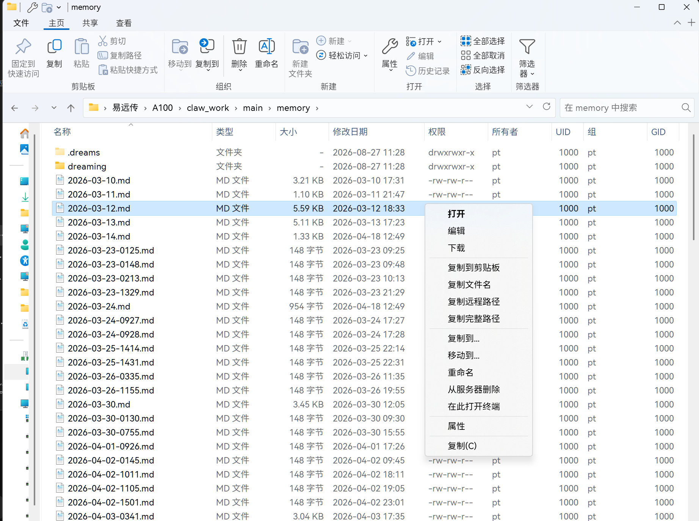
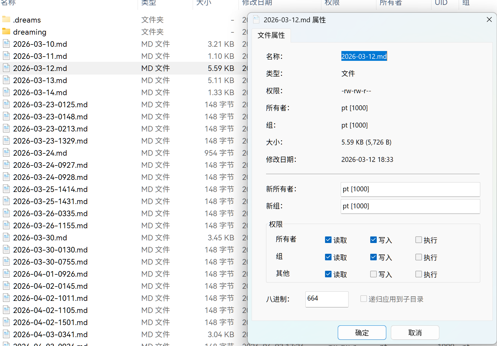

# 易远传 · ExploreRemoteFiles

**把远程 Linux 主机（SFTP / FTP）挂进 Windows 资源管理器的导航窗格**——像本地文件夹一样浏览、
看权限、复制粘贴、拖放传输，并且**保留 POSIX 语义**（所有者、属组、`rwxr-xr-x` / `755`）。

名字里的三个字母就是图标上的 **E / R / F**（ExploreRemoteFiles）：**E** 居中，**R** 在左下表示
远程站点连接状态，**F** 在右下表示文件传输状态，两国字母各自变色显示状态。

---

## ⚠️ 风险提示：这是早期版本（Alpha），请谨慎使用

- **没有经过充分测试**：目前只在作者自己的两台机器上实测过（Windows 10 22H2 / Windows 11），
  **没有大规模用户验证**，**没有代码签名**。请把它当作"能用但还毛糙"的早期软件。
- **可能遇到功能异常，甚至数据损失**：远程目录里的**删除、覆盖、改权限都是立刻真实生效**的。
  重要数据请另留一份可访问的副本，不要把它当作唯一的文件管理手段。
- **未签名的直接后果**：SmartScreen 会提示"未知发布者"，需要点"更多信息 → 仍要运行"；
  个别杀毒软件可能误报。这是未签名软件的必然现象，不代表程序行为异常。
- **安装/升级/卸载会短暂影响资源管理器**：升级时替换扩展 DLL 的那 1–3 秒会终止 explorer.exe
  （桌面短暂黑屏、任务栏暂时消失，随后自动恢复）；向导会先弹出确认框讲清后果，**全新安装不会**。
  卸载**不会**终止资源管理器（旧 DLL 改名后由下次登录自动清理）。
- **出问题请反馈**：到 [Issues](https://github.com/RyzeZhou/ExploreRemoteFiles/issues) 报告，
  附上日志更好（见文末"出问题了怎么办"）。

---

## 它长什么样

导航窗格里多一个「易远传」，点进去就是远程 Linux 目录，列、排序、右键菜单都跟本地一致：



右键属性就是 Linux 那一套：所有者、属组、`rwxr-xr-x` 与数字权限都能看、都能改（含递归）：



---

## 它能做什么

**浏览与导航**
- 导航窗格入口，多站点并列；面包屑 / 地址栏 / 后退 / 上级 / F5 都按资源管理器原生行为
- 10 万文件的大目录也不会卡死资源管理器（网络动作全在后台，UI 线程绝不等待网络）

**POSIX 语义**（本地资源管理器没有的部分）
- 列与属性页显示：大小、修改时间、**所有者**、**属组**、**权限**
- 权限 `rwxr-xr-x` 与 `755` 两种写法都能看、都能改
- **递归改权限**（`chmod -R`，文件与目录都改）与**递归改属主/属组**（`chown -R`，支持用户名或数字 ID）

**读写与传输**
- 新建文件夹、重命名、删除（含递归删除，有真实进度与取消）
- 复制 / 剪切 / 粘贴：远程 ↔ 本地、远程 → 远程；从资源管理器拖放上传、拖出下载
- 远程操作队列：删除 / 递归改权限 / 传输共用一个队列窗口，带进度、当前项、错误汇总，可暂停

**打开终端**
- 远程目录右键「在 Windows 终端中打开」：Windows Terminal 配置文件 与 VS Code 两条路线
- **认证交给终端里的 `ssh`**，产品本身不碰你的凭据

**其它**
- `erf://` 地址协议；托盘图标显示连接与传输状态
- 站点凭据存进 **Windows 凭据管理器**（`ExplorerRemoteFs/*`），不落明文文件
- 文件大小显示口径与资源管理器一致（交给 Windows 自己格式化）
- **不需要预装 .NET**：客户端与命令行各自带运行时，装完即用

---

## 下载与安装

到 [**Releases**](https://github.com/RyzeZhou/ExploreRemoteFiles/releases) 下载
**`Erf-0.1-Alpha-Setup.exe`**（单文件、自包含，约 131 MB）。

- 系统要求：**Windows 10 19045+ / Windows 11，64 位**
- **只装当前用户**（默认 `%LOCALAPPDATA%\ExplorerRemoteFs`），不弹 UAC、不需要管理员
- 向导里可选：安装目录、创建桌面快捷方式、登录时自启动
- 卸载：**设置 → 应用 → 已安装的应用 → 易远传**（站点配置与凭据会保留）

## 第一次使用

1. 打开资源管理器，导航窗格里点「易远传」（或双击桌面快捷方式打开客户端窗口）
2. 在客户端里**添加站点**：主机、端口、用户名；密码存进 Windows 凭据管理器
   （SFTP 也可以直接复用 `~/.ssh/config` 里已有的主机别名）
3. 回到资源管理器，进站点目录就是远程文件系统；右键有权限、终端、复制等命令

---

## 已知限制（Alpha）

- 上传/下载尚未并入统一操作队列的进度与暂停体系（复制/移动本身可用）
- 深相对路径经剪贴板协议无法表达 —— 已改为**明确拒绝**而不是静默出错
- SFTP 上"多而小文件"的传输性能与完整性是下一步工作（ERF 协议：并行会话 / 打包流 + 校验）
- 只有 per-user 安装；不做 MSIX（MSIX 不支持这类 in-proc Shell 扩展），也暂不做 per-machine 安装
- 界面目前只有简体中文与英文

## 出问题了怎么办

1. 运行时日志：`%LOCALAPPDATA%\ExplorerRemoteFs\logs\remotefs-debug.log`
2. 安装/卸载问题：用 `/LOG="C:\path\setup.log"` 重跑一次，把日志一起附上
3. 到 [Issues](https://github.com/RyzeZhou/ExploreRemoteFiles/issues) 报告，
   写清 Windows 版本、协议（SFTP/FTP）、操作步骤与现象

## 从源码构建

需要 VS2022（C++ 工具集 + Windows SDK）、.NET 8 SDK、Inno Setup 6/7：

```powershell
powershell -ExecutionPolicy Bypass -File scripts\build-release.ps1   # 扩展 DLL / CLI / 客户端
powershell -ExecutionPolicy Bypass -File src-setup\build-inno.ps1    # 出安装包（含 DLL 哈希自校验）
powershell -ExecutionPolicy Bypass -File src-setup\inno-test.ps1     # 自检：装到临时目录→断言→卸载
```

架构一句话：资源管理器里跑一个 C++ Shell 命名空间扩展（进程内、只读缓存、绝不阻塞 UI），
网络动作交给常驻的 WPF 客户端与一次性 CLI 子进程 —— **资源管理器进程永远不做网络 I/O**。

## 许可

[MIT](LICENSE)。作者 RyzeZhou。
